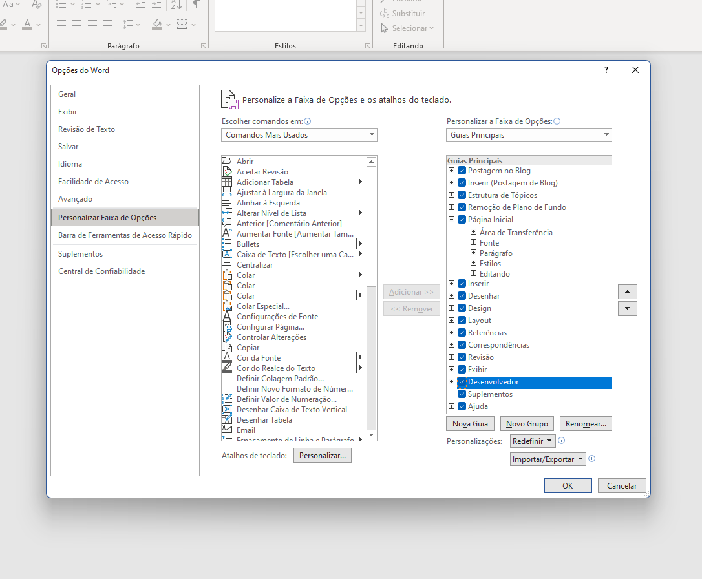
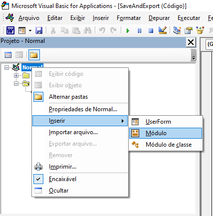
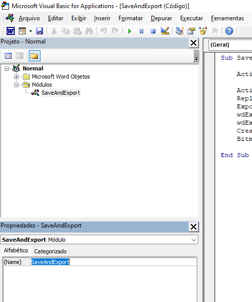
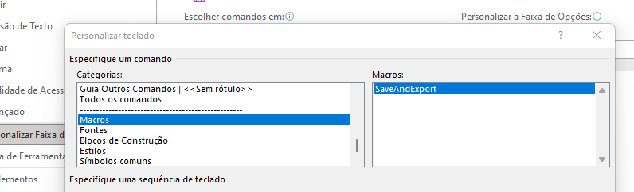

# autoPDFexporter
Small repository to record the configuring steps of enabling automatic PDF exporter through a keybind on Microsoft Word.

### First you need to allow developer tab on Word
Open Word options >> Customize ribbon. On the right there will be an unchecked "Developer" option. Check that box and press OK. The Developer tab on top of Microsoft Word should appear.

### Add the Macro to Word
Go to the developer tab >> Visual Basic. The VB window should appear. On the left there will be a bar with the "Normal" project. Right click over it >> Insert >> Module.

Take the SaveAndExport.bas present in this repository and copy paste the code on the code window. Change the name of the module to "SaveAndExport" and save to your folder of choice.

You can close the Visual Basic Window. The macro is ready to be used!

### Let's access this macro everytime you save with the CRTL + S keybind!
Open Word options >> Customize ribbon. On the bottom left, click to customize the keyboard shortcuts. On the left window, find "Macros" and choose "SaveAndExport" on the right window. Add a new keybind by clicking on the bottom left space and typing CRTL + S. Save and exit.

DONE!